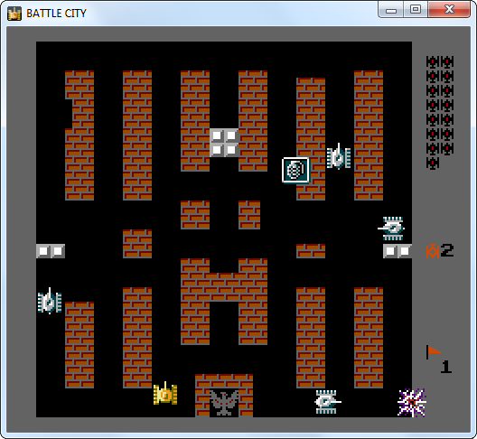

# Battle City

Наближена реконструкція класичної BattleCity / Tank 1990.\
Гра написана на С++17 з використанням бібліотеки SFML.

## Елементи управління:

 - Гра: Клавіші WASD для руху гравця та клавіша J для стрільби.
 - Меню: Клавіші WS для навігації та клавіша ENTER для вибору.
 - Пауза: SPACE.
 - Вихід: ESCAPE.

## Додатково
В кінці кожного рівня гра самозберігається.
